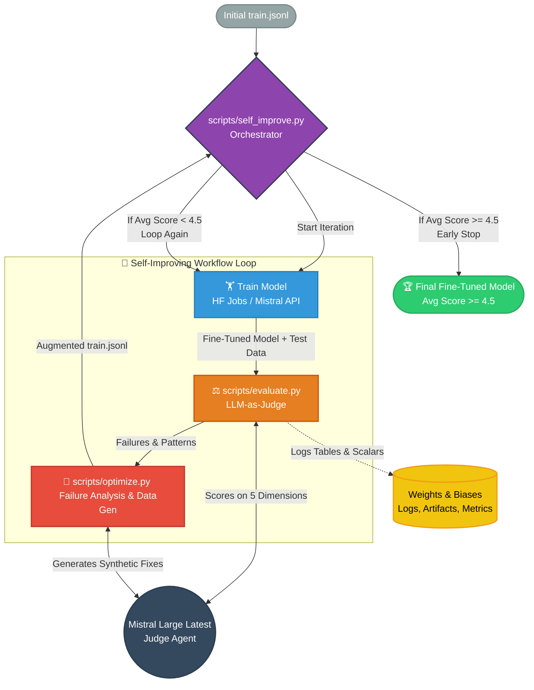

# 🛡️ Ward: Automated Security Policy Enforcement for Mistral Vibe

[](https://pypi.org/project/mistral-vibe)
[](https://www.python.org/downloads/release/python-3120/)
[](https://mistral.ai)

```text
██████████████████░░
██████████████████░░
████  ██████  ████░░
████    ██    ████░░
████          ████░░
████  ██  ██  ████░░
██      ██      ██░░
██████████████████░░
██████████████████░░
```


**Ward** is a specialized fork of Mistral Vibe, built to bridge the gap between code generation and security compliance.

> 💡 **Note:** This project is built on top of [Mistral Vibe](https://github.com/mistralai/mistral-vibe). You can find the original, unmodified Mistral Vibe README [here](https://github.com/mistralai/mistral-vibe/blob/main/README.md).


## 📑 Table of Contents

- [🚀 What is Ward?](#-what-is-ward)
- [🧠 The AI Pipeline & Repository Structure](#-the-ai-pipeline--repository-structure)
  - [🛠️ How the Fine-Tuning Works](#️-how-the-fine-tuning-works)
- [🎯 Usage: The `/security` Command](#-usage-the-security-command)
- [⚙️ Standard Vibe Installation & Setup](#️-standard-vibe-installation--setup)
  - [One-line install (recommended)](#one-line-install-recommended)
  - [Quick Start](#quick-start)
- [📊 Evaluation & Tracking](#-evaluation--tracking)
- [📄 License](#-license)


## 🚀 What is Ward?

Modern Engineering Managers want to enforce custom security policies (e.g., "No eval()", "Mandatory Parameterization") across PRs, but base LLMs are inconsistent and struggle with structured policy reasoning.

Ward solves this by introducing a native `/security` command into Mistral Vibe. It uses a **Dual-Agent Pipeline**:

1. **The Analyst (Fine-Tuned Mistral Large 2)**: Scans the active file or PR diff, enforces strict security policies, and generates a structured JSON report (Violation, Severity, Risk Explanation).
2. **The Coder (Codestral)**: Ingests the Analyst's report and automatically streams a compliant patch directly into your terminal.

No complex UI. Security audits live exactly where the code lives.




## 🧠 The AI Pipeline & Repository Structure

We didn't just write a prompt; we built an entire data bootstrapping and fine-tuning pipeline to teach Mistral how to reason about security vulnerabilities.

Here is how the project is structured:

```plaintext
mistral-vibe/
├── ai_pipeline/                 # 🧠 WARD'S TRAINING ENGINE
│   ├── 1_fetch_github.py        # Mines GitHub Security Advisories for real-world fixes
│   ├── 2_fetch_bigvul.py        # Extracts and balances vulnerable/safe pairs from BigVul
│   ├── 3_pair_datasets.py       # "Teacher-Student" bootstrapping: uses Mistral Large to write plain-English risk explanations
│   ├── 4_append_sard.py         # Fills edge-case gaps (deserialization, eval) using SARD
│   ├── run_pipeline.py          # Formats everything into conversational JSONL for Mistral API
│   └── dataset/                 # Holds the generated train/val/test splits
│
├── vibe/cli/                    # 💻 VIBE CLI INTEGRATION
│   ├── commands.py              # Registers the new `/security` slash command
│   └── textual_ui/app.py        # Implements the `_security_command` handler & Agent handoff
│
└── ...                          # Original Mistral Vibe source code
```

### 🛠️ How the Fine-Tuning Works

If you want to reproduce our fine-tuning process:

1. Navigate to the `ai_pipeline` folder.
2. Add your API keys to the `.env` file.
3. Run the pipeline script to gather raw data, bootstrap labels using Mistral Large, and dispatch the fine-tuning job:

```bash
python run_pipeline.py
python ../scripts/finetune_security.py --train dataset/train.jsonl --val dataset/val.jsonl
```


## 🎯 Usage: The `/security` Command

Once installed, simply open Mistral Vibe in your project folder and type the command:

```text
> /security
```

**What happens next:**
1. **Context Gathering:** Vibe grabs your current file/diff.
2. **Analysis:** The fine-tuned Ward model identifies vulnerabilities (e.g., SQL Injection, Hardcoded Secrets).
3. **Reporting:** Prints a clean, markdown-formatted risk explanation.
4. **Remediation:** The native Vibe Agent immediately starts streaming the fixed, compliant code to patch the vulnerability.


## ⚙️ Standard Vibe Installation & Setup

Since Ward is built directly into Mistral Vibe, the installation process remains the same as the original CLI.

### One-line install (recommended)

**Linux and macOS**
```bash
curl -LsSf https://mistral.ai/vibe/install.sh | bash
```

**Windows (Using uv)**
```powershell
powershell -ExecutionPolicy ByPass -c "irm https://astral.sh/uv/install.ps1 | iex"
uv tool install mistral-vibe
```

### Quick Start
Navigate to your project's root directory:
```bash
cd /path/to/your/project
```

Run Vibe:
```bash
vibe
```

Type `/security` to trigger the Ward Security Enforcer!


## 📊 Evaluation & Tracking

We track the model's performance using **Weights & Biases**. We evaluate the fine-tuned model against a baseline across:

* **Precision & Recall** for specific CWE policy violations.
* **False Positive Rate** on safe code (enforced via dataset balancing).
* **Patch Quality Score** (Using LLM-as-a-judge to ensure the suggested patch actually compiles and fixes the flaw).


## 📄 License

Copyright 2026 Mistral AI & Ward Team

Licensed under the Apache License, Version 2.0 (the "License"). See the `LICENSE` file for the full license text.
