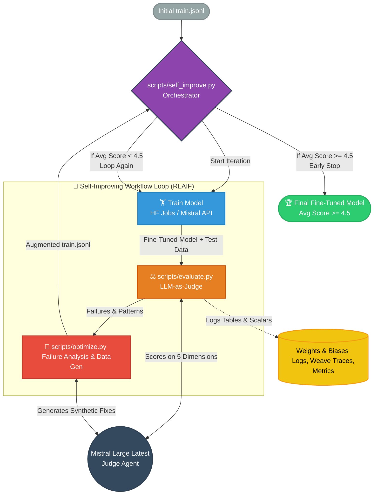

# 🛡️ Wardstral: Automated Security Policy Enforcement for Mistral Vibe

[](https://pypi.org/project/mistral-vibe)
[](https://www.python.org/downloads/release/python-3120/)
[](https://mistral.ai)

```text
██████████████████░░
██████████████████░░
████  ██████  ████░░
████    ██    ████░░
████          ████░░
████  ██  ██  ████░░
██      ██      ██░░
██████████████████░░
██████████████████░░
```


**Wardstral** is a specialized fork of Mistral Vibe, built to bridge the gap between code generation and security compliance.

> 💡 **Note:** This project is built on top of [Mistral Vibe](https://github.com/mistralai/mistral-vibe). You can find the original, unmodified Mistral Vibe README [here](https://github.com/mistralai/mistral-vibe/blob/main/README.md).

## 📑 Table of Contents

- [🚀 What is Wardstral?](#-what-is-wardstral)
- [🧠 The AI Pipeline & Repository Structure](#-the-ai-pipeline--repository-structure)
  - [🛠️ How the Fine-Tuning Works](#️-how-the-fine-tuning-works)
- [🎯 Usage: The `/security` Command](#-usage-the-security-command)
- [📊 Evaluation & MLOps (W&B)](#-evaluation--mlops-wb)
- [⚙️ Standard Vibe Installation & Setup](#️-standard-vibe-installation--setup)
- [📄 License](#-license)

## 🚀 What is Wardstral?

Modern Engineering Managers want to enforce custom security policies (e.g., "No buffer overflows", "Mandatory SQL Parameterization") across PRs, but base LLMs are inconsistent and struggle with structured policy reasoning.

Wardstral solves this by introducing a native `/security` command into Mistral Vibe. It uses a **Dual-Agent Pipeline**:

1. **Fine-Tuned WARD Model**: Scans the active file or PR context, enforces strict security policies, and generates a structured JSON report (Violation, Severity, Risk Explanation).
2. **Devstral**: Ingests the Analyst's report and automatically streams a compliant patch directly into your terminal using native Vibe tools.

No complex UI. Security audits live exactly where the code lives.




## 🧠 The AI Pipeline & Repository Structure

We didn't just write a prompt; we built an entire decoupled MLOps pipeline. We separated raw data extraction from business logic to eliminate structural bias via a Global Shuffle.

> 💡**Quick-start:** to regenerate the training dataset from scratch you need a few environment variables and then run the steps below. This is useful if you want to add a new policy or debug a particular extractor.

```bash
# set your credentials (GitHub, Mistral, W&B)
export MISTRAL_API_KEY="..." GITHUB_TOKEN="..." WANDB_API_KEY="..."
cd ai_pipeline

# run all of the extractors & merge logic in one shot
python run_pipeline.py

# the resulting files live under ai_pipeline/dataset/
# e.g. train.jsonl, val.jsonl, etc.
```

You can also invoke the individual scripts manually if you only
need one stage (1_fetch_github.py, 3_prepare_sard.py, etc.).
Here is how the project is structured:

```plaintext
mistral-vibe/
├── ai_pipeline/                 # 🧠 WARDSTRAL'S DATA ENGINE (Decoupled Architecture)
│   ├── 1_fetch_github.py        # Mines GitHub Security Advisories
│   ├── 2_fetch_bigvul.py        # Fetches raw BigVul dataset from Hugging Face
│   ├── 3_prepare_sard.py        # Prepares SARD synthetic data for edge cases
│   ├── 4_merge_and_split.py     # "The Brain": Pairs CWEs, Formats ChatML, Global Shuffle
│   ├── 5_assign_severity.py     # LLM-based enrichment (Low/Medium/High/Critical)
│   ├── 6_evaluation.py          # Validation scoring
│   ├── 7_remediation.py         # Patch logic testing
│   └── run_pipeline.py          # Orchestrates steps 1 -> 4
│
├── scripts/                     # ⚖️ MLOps & EVALUATION
│   ├── evaluate.py              # W&B LLM-as-a-Judge benchmark script
│   └── self_improve.py          # RLAIF orchestrator loop
│
├── vibe/cli/                    # 💻 VIBE CLI INTEGRATION
│   ├── commands.py              # Registers the new `/security` slash command
│   └── textual_ui/app.py        # Implements `_fix_security()` Dual-Agent handoff
```

### 🛠️ How the Fine-Tuning Works

To reproduce our fine-tuning and data orchestration process:

1. Setup your `.env` with `MISTRAL_API_KEY`, `GITHUB_TOKEN`, and `WANDB_API_KEY` as above.
2. Generate the dataset using the micro-extractors:
   ```bash
   cd ai_pipeline
   python run_pipeline.py
   ```

3. Switch to the `scripts` directory and start the self-improvement loop.
   The loop will launch training jobs, evaluate with the judge model, and
   automatically augment the data until the average score exceeds 4.5:
   ```bash
   cd ../scripts
   python self_improve.py \  # see --help for dataset/model flags
       --dataset-repo=username/security-vuln-dataset \
       --model=some-base
   ```

4. Once you have a final model you can launch a standalone inference job:
   ```bash
   python launch_inference.py --model=ward-final --output=ward.jsonl
   ```

The helper scripts (`launch_finetune.py`, `launch_inference.py`,
`judge_gemini.py`) all accept `--dataset-repo` and other options; run them
with `--help` to explore the CLI.


### 🎯 Usage: The /security Command
For local development and testing, install the project in editable mode:

```bash
pip install -e .
vibe         # start the interactive CLI
```

Once inside the UI, open a vulnerable file and type:

```plaintext
> /security
```

Alternatively, you can run the same operation non‑interactively with the
command‑line flag (useful for CI or editors):

```bash
vibe -fix_security path/to/file.c
```

The flow is identical in both cases:

1. **Context Gathering:** Vibe grabs your current active code or the
   contents of the specified file.
2. **Analysis:** the fine‑tuned `WARD` model produces a structured JSON
   audit report describing each violation, its severity, and a rationale.
3. **Remediation:** the `Codestral` agent reads the report and streams a
   patch back through Vibe's native tools (`write_file`,
   `search_replace`, etc.), automatically editing the code in place.

You can inspect the implementation in `vibe/cli/commands.py` (command
registration) and `vibe/cli/textual_ui/app.py` (handler and agent logic).
A programmatic entry point is exposed as
`vibe.commands._fix_security()` if you want to reuse the engine from a
custom script.

Below is a simple before/after example produced by `/security`:

```diff
--- vulnerable.c
+++ patched.c
@@
-    strcpy(buf, input);            // unsafe buffer copy
+    strncpy(buf, input, sizeof buf); // fixed with bounds check
```

This patch streaming behaviour is what makes Wardstral feel native; the
analysis and fix occur in the same session where you write code.

### 🏆 Mistral AI Worldwide Hackathon 2026

This product — including the data‑engineering pipeline, fine‑tuning loops, and the `/security` CLI integration — was conceived, coded, and documented in a single 24‑hour sprint during the
[Mistral AI Worldwide Hackathon](https://mistral.ai) running from Feb 28 to Mar 1, 2026. The team behind Wardstral comprised
**Federico Giorgi**, **Tommaso Ravasio**, and **Ratnam Shah**.
